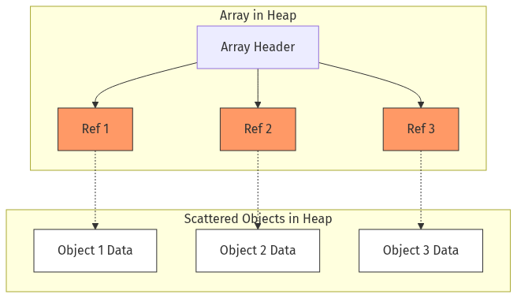
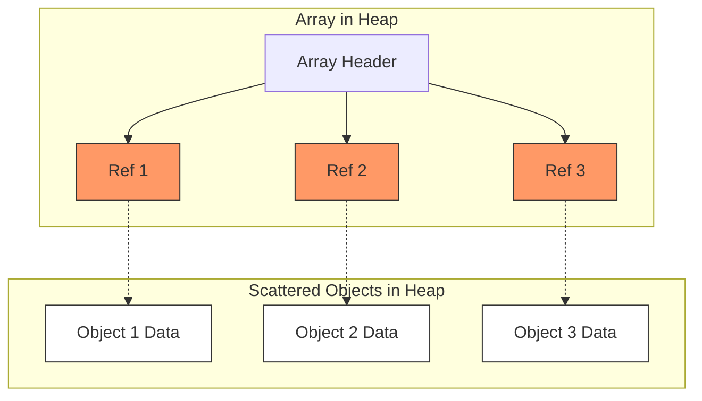
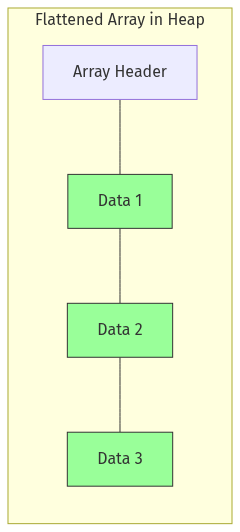
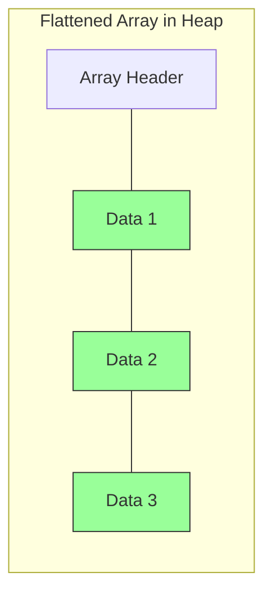
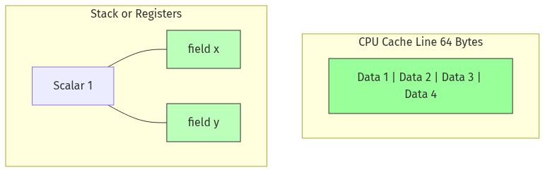
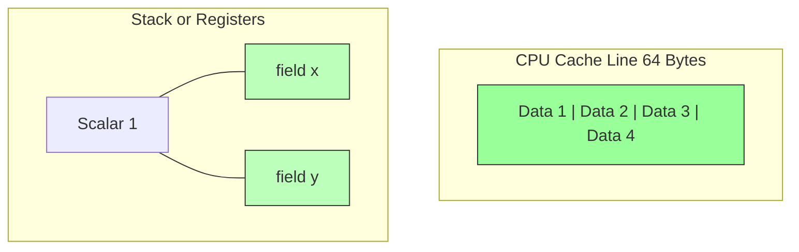

# Project Valhalla: Java Value Types and Performance

## 1. Introduction to Project Valhalla

* **Project Page:** [OpenJDK: Project Valhalla](https://openjdk.org/projects/valhalla/)
* **Goal:** Revitalize the Java Object Model to better match modern hardware.
* **Slogan:** "Codes like a class, works like an int."
* **Main Objective:** Reducing memory overhead and improving data locality by introducing **Value Objects**.

## 2. The Evolution of Java Types

* **Today's Dichotomy:**
    * **Primitives:** Fast, no identity, stack-allocated or flattened, but not objects (no methods, no generics
      support).
    * **Objects:** Rich abstractions, but heavy (object header), identity-based, and always referenced (indirection).
* **The Valhalla Vision:** A unified type system where you can have the best of both worlds.

## 3. Key JEPs in Project Valhalla

* **[JEP 401: Value Classes and Objects (Preview)](https://openjdk.org/jeps/401)**
    * Introduces `value class`.
    * Value classes have no identity (no `==` based on address, no `synchronized`, no `System.identityHashCode`).
    * Allows the JVM to optimize storage: **Heap Flattening**.
* **[JEP 402: Enhanced Primitive Boxing (Preview)](https://openjdk.org/jeps/402)**
    * Reimagines primitive wrappers (like `Integer`) as value classes.
    * Enables better integration with generics without the "boxing tax".
* **Null-Restricted and Nullable Types**
    * Allows declaring types that cannot be null (`ValueType!`), enabling even more aggressive flattening (no
      null-marker bit needed).

## 4. The Problem: Pointer Chasing

* **Reference-Heavy Arrays:**
    * In standard Java, an array of objects (`Complex[]`) is an array of *references* to objects scattered on the heap.
    * Accessing an element requires:
        1. Loading the reference from the array.
        2. Following the pointer to the heap (Indirection).
        3. Loading the actual data.
* **The Cost:** Each indirection is a potential **Cache Miss**. Modern CPUs spend a significant amount of time "idling"
  while waiting for data from main memory.

## 5. The Solution: Heap Flattening

* **Flattened Arrays:**
    * With `value class`, the JVM can store the actual data fields of the object directly inside the array's memory
      block.
    * An array of `ValuePoint` (with `x`, `y` longs) becomes a contiguous block of memory:
      `[x1, y1, x2, y2, x3, y3, ...]`.
* **Benefits:**
    * **No Indirection:** No pointers to follow.
    * **Compactness:** No object headers for each element (saves 12-16 bytes per object).

## 6. CPU Caches and Data Locality

* **Sequential Access:** CPUs are extremely fast at reading contiguous memory.
* **Cache Lines:** When the CPU loads a value, it loads an entire "cache line" (typically 64 bytes).
* **Efficiency:**
    * **Flattened:** A single cache line might contain several flattened value objects. Processing them is nearly
      instantaneous.
    * **Traditional:** A cache line contains references. Following each reference might trigger a new load from a
      different part of the heap, wasting cache capacity and cycles.

## 7. FastDecimal Case Study

* **Context:** `FastDecimal` vs `ValueFastDecimal`.
* **FastDecimal (Current):** A standard class wrapping a `long`.
* **ValueFastDecimal (Valhalla):** Declared as `public value class ValueFastDecimal`.
* **Performance Impact:**
    * Large arrays of `ValueFastDecimal` see massive speedups in iterations because they map perfectly to CPU cache
      prefetching.
    * Reduced GC pressure: Flattened objects don't need to be tracked individually by the Garbage Collector.

## 8. Summary

* Project Valhalla fixes the "memory wall" by allowing objects to behave like primitives.
* **Value Types** eliminate identity, enabling **Flattening**.
* **Flattening** eliminates **Pointer Chasing**.
* The result is code that is both highly abstract and highly performant on modern CPU architectures.
